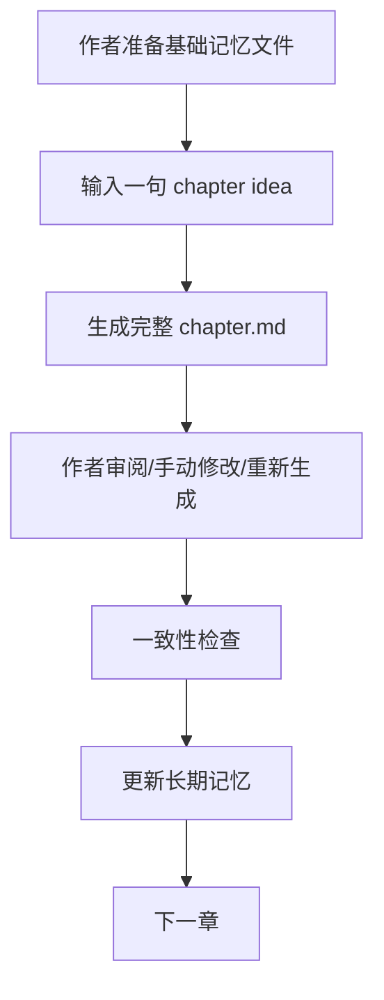

# Novel Writing Pipeline

本地大模型 + LoRA + 结构化记忆的长篇小说写作流水线。

[](#)
[](#)
[](#)
[](#)
[](#)
[](https://huggingface.co/yuxinlu1/qwen3-6-27b-chinese-fiction-lora)

[English](./README_EN.md) | 简体中文

GitHub: [DuckTraDo/Novel](https://github.com/DuckTraDo/Novel) · LoRA: [Hugging Face release](https://huggingface.co/yuxinlu1/qwen3-6-27b-chinese-fiction-lora)

这个项目把长篇小说创作拆成一个可审阅、可记忆、可持续推进的循环：作者决定每章方向，模型一次性起草完整章节，pipeline 负责长期记忆、连续性检查和后续上下文组织。

旧版 scene-level workflow 已废弃，因为多次独立生成容易造成重复和割裂。当前推荐整章一次生成。

## Workflow



## ✨ Features

- Local-first，不依赖云端模型
- OpenAI-compatible API，便于接入本地推理服务
- 支持 llama.cpp server 或其他兼容服务
- 支持 LoRA 写作风格适配
- 一句 chapter idea 生成完整章节
- 结构化长期记忆：人物、事件、时间线、伏笔、章节摘要
- 章节后记忆更新
- 完整章节一致性检查
- 文件型 pipeline，简单稳定，无需数据库

## 🖋️ LoRA Weights

第一版中文小说文风 LoRA 已发布到 Hugging Face：

**https://huggingface.co/yuxinlu1/qwen3-6-27b-chinese-fiction-lora**

LoRA 权重不放在 GitHub repo 中。GitHub repo 只放 pipeline 代码、文档和配置模板。

## 📁 Project Structure

```text
pipeline/
├── config.yaml
├── README.md
├── README_EN.md
├── SECURITY_CHECKLIST.md
│
├── memory/
│   ├── story_bible.yaml
│   ├── characters.yaml
│   ├── foreshadowing.yaml
│   ├── relationships.json
│   ├── timeline.jsonl
│   ├── events.jsonl
│   ├── chapter_summaries.jsonl
│   └── style_bank.jsonl
│
├── outlines/
│   └── book_outline.yaml
│
├── chapters/
│   └── ch001/
│       └── chapter.md
│
├── outputs/
│   └── reports/
│
└── scripts/
    ├── utils.py
    ├── generate_chapter_local.py
    ├── check_consistency.py
    ├── update_memory_after_chapter.py
    └── reset_chapter.py
```

## 🚀 推荐写作流程

### 1. 新书开始前，先编辑基础文件

- `memory/story_bible.yaml`
- `memory/characters.yaml`
- `outlines/book_outline.yaml`
- `memory/style_bank.jsonl`
- `memory/foreshadowing.yaml` 可选

### 2. 每章只写一句 chapter idea

```powershell
python scripts/generate_chapter_local.py --chapter ch001 --idea "第一章：主角回到故乡，发现父亲留下的一封信，并决定调查多年前的旧事。" --target-words 4000 --overwrite
```

也可以从文件读取：

```powershell
python scripts/generate_chapter_local.py --chapter ch001 --idea-file inputs/ch001_idea.txt --target-words 4000 --overwrite
```

### 3. 作者检查/修改

正文在：

```text
chapters/ch001/chapter.md
```

如果不满意，可以手动改，也可以重新生成。

### 4. 一致性检查

```powershell
python scripts/check_consistency.py --chapter ch001
```

### 5. 更新长期记忆

```powershell
python scripts/update_memory_after_chapter.py --chapter ch001
```

### 6. 下一章同理

```powershell
python scripts/generate_chapter_local.py --chapter ch002 --idea "第二章大概发生什么。" --target-words 4000 --overwrite
```

## 🖥️ 桌面应用（推荐给不熟悉命令行的用户）

`app/` 是一个 Tauri 桌面应用，把上面的命令行流程封装成图形界面，无需记参数，点按钮即可完成「生成章节 / 看改正文 / 一致性检查 / 更新记忆 / 编辑记忆与大纲」。

界面只是封装，真正干活的仍是 `scripts/*.py`，命令行用法照旧可用。应用启动时会自动向上定位到本仓库根目录。

### 环境要求

- Node.js 18+ 与 npm
- Rust 工具链（`rustc` / `cargo`）
- Python 3.10+ 且已安装 `openai`、`pyyaml`（命令行版同样需要）
- 一个本地 OpenAI 兼容推理服务（如 llama.cpp server）

### 启动开发模式

```powershell
cd app
npm install
npm run tauri dev
```

### 打包成可执行程序

```powershell
cd app
npm run tauri build
```

### 界面功能

- **章节工作台**：选章 / 新建 → 填一句 idea + 目标字数 → 生成或重新生成 → 正文可直接编辑保存 → 一致性检查 / 更新记忆 / 重置本章
- **报告**：在界面内渲染生成报告、一致性报告、记忆更新报告
- **记忆库**：表单式编辑 story bible、角色、大纲、伏笔、风格库等，降低手写 YAML 门槛
- **设置**：配置 Python 路径、LLM 地址 / 密钥 / 模型；保存到仓库根目录的 `.ui-settings.json`（已被 gitignore），运行脚本时通过环境变量注入

## 🧩 Core Files

- `memory/story_bible.yaml`：故事圣经，包含世界观、主题、限制和写作规则
- `memory/characters.yaml`：角色档案与人物状态
- `memory/foreshadowing.yaml`：伏笔记录、状态和回收计划
- `memory/events.jsonl`：事件流水账，便于后续检索和回顾
- `memory/timeline.jsonl`：时间线记录，降低顺序错乱风险
- `memory/chapter_summaries.jsonl`：章节摘要，帮助后续章节继承上下文
- `memory/style_bank.jsonl`：风格样例和表达偏好
- `outlines/book_outline.yaml`：全书方向、结构和章节规划
- `chapters/<chapter_id>/chapter.md`：每章正文
- `outputs/reports/`：生成报告、一致性报告、记忆更新报告

## Script Reference

### Generate a chapter

```powershell
python scripts/generate_chapter_local.py --chapter ch001 --idea "第一章：主角回到故乡，发现父亲留下的一封信，并决定调查多年前的旧事。" --target-words 4000 --overwrite
```

常用参数：

- `--idea` / `--idea-file`：二选一
- `--target-words`：目标中文字数，默认 4000
- `--overwrite`：允许覆盖已有 `chapter.md`
- `--no-context`：不读取长期记忆，只根据 idea 生成
- `--dry-run`：只构建 prompt 和报告，不调用 LLM

### Check consistency

```powershell
python scripts/check_consistency.py --chapter ch001
```

### Update memory

```powershell
python scripts/update_memory_after_chapter.py --chapter ch001
```

### Reset a chapter

```powershell
python scripts/reset_chapter.py --chapter ch001
```

默认只删除：

- `chapters/ch001/`
- `outputs/reports/ch001_*`

如果需要同时过滤该章在长期记忆里的记录：

```powershell
python scripts/reset_chapter.py --chapter ch001 --include-memory
```

只会过滤：

- `memory/chapter_summaries.jsonl`
- `memory/events.jsonl`
- `memory/timeline.jsonl`

不会删除 story bible、人物档案、全书大纲、风格库或伏笔文件。

## 🛡️ Safety / Privacy

这个项目默认面向本地写作和本地推理。公开仓库时，请尤其注意：

- 不要提交 `.env`
- 不要提交接口密钥、访问令牌或其他凭证
- 不要提交本地模型或适配器文件
- 不要提交私稿 `chapters/`
- 不要提交生成产物 `outputs/`
- 不要提交训练数据原文或未授权文本
- 当前 `.gitignore` 已默认排除常见本地模型、私稿和生成报告

## 🗺️ Roadmap

- [x] 文件型记忆系统
- [x] 整章一次生成
- [x] 章节后记忆更新
- [x] 完整章节一致性检查
- [x] 第一版中文小说 LoRA 发布到 Hugging Face
- [x] 桌面应用（Tauri，图形界面，见下文 `app/`）
- [ ] 检索增强记忆
- [ ] 多 LoRA 风格库
- [ ] 一键导出书稿

## 🤝 Contributing

Issues and PRs are welcome. Useful contribution areas include prompt improvements, pipeline scripts, consistency checking, and local model compatibility.

## License

License: TBD. A proper open-source license will be added soon.
