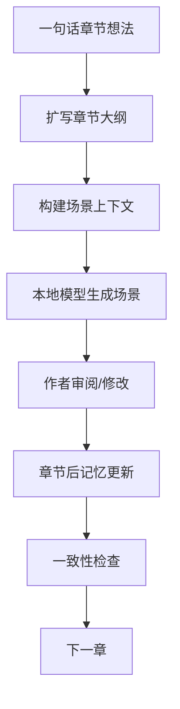

# Novel Writing Pipeline

本地大模型 + LoRA + 结构化记忆的长篇小说写作流水线

[](#)
[](#)
[](#)
[](#)
[](#)
[](#license)

[English](./README_EN.md) | 简体中文

📚 这是一个 local-first 的长篇小说写作 pipeline。它不是让模型一次性写完整本小说，而是把长篇创作拆成一个可持续、可审阅、可记忆的写作循环：

一句话章节想法 → AI 扩写章节大纲 → 场景级上下文组装 → 本地模型生成正文 → 章节后自动更新记忆 → 一致性检查 → 继续下一章

> 作者负责方向。  
> 模型负责起草。  
> Pipeline 负责记忆和连续性。

## 目录

- [Workflow](#workflow)
- [✨ Features](#features)
- [🧠 Why This Exists](#why-this-exists)
- [📁 Project Structure](#project-structure)
- [🚀 Quick Start](#quick-start)
- [🧩 Core Files](#core-files)
- [🖋️ LoRA Roadmap](#lora-roadmap)
- [🛡️ Safety / Privacy](#safety-privacy)
- [🗺️ Roadmap](#roadmap)
- [🤝 Contributing](#contributing)
- [📌 License](#license)

## Workflow



<a id="features"></a>

## ✨ Features

- Local-first，不依赖云端模型
- OpenAI-compatible API，便于接入本地推理服务
- 支持 llama.cpp server
- 支持 LoRA 写作风格适配
- 一句话扩写章节大纲
- 场景级 context builder
- 结构化记忆系统
- 章节后记忆更新
- 一致性检查
- 文件型 pipeline，简单稳定，无需数据库

<a id="why-this-exists"></a>

## 🧠 Why This Exists

长篇小说不能只靠一个超大 context。几十万字、一百万字的故事，不可能每次都完整塞给模型；即使窗口足够大，角色变化、伏笔、时间线和叙事节奏也需要被结构化管理。

这个项目把长篇写作拆成更稳的记忆系统：

- story bible：世界观、主题、叙事规则
- character memory：人物设定、关系、变化
- events：已经发生的重要事件
- timeline：时间线与先后顺序
- foreshadowing：伏笔、回收与状态
- summaries：章节摘要
- style bank：可复用的风格参考

模型每次只拿当前场景真正需要的上下文，作者则始终保留判断、修改和取舍的权力。

<a id="project-structure"></a>

## 📁 Project Structure

```text
pipeline/
├── config.yaml                 # 全局配置
├── README.md                   # 中文 README
├── README_EN.md                # English README
├── SECURITY_CHECKLIST.md       # 安全检查清单
│
├── memory/                     # 持久化故事记忆
│   ├── story_bible.yaml        # 世界观、主题、写作规则
│   ├── characters.yaml         # 角色档案
│   ├── foreshadowing.yaml      # 伏笔追踪
│   ├── relationships.json      # 人物关系
│   ├── timeline.jsonl          # 时间线记录
│   ├── events.jsonl            # 事件记录
│   ├── chapter_summaries.jsonl # 章节摘要
│   └── style_bank.jsonl        # 风格参考库
│
├── outlines/                   # 大纲文件
│   ├── book_outline.yaml       # 全书大纲
│   └── chapter_outlines.yaml   # 章节大纲
│
├── chapters/                   # 本地生成私稿目录，默认忽略，请勿提交
├── outputs/                    # 本地生成上下文和报告，默认忽略
│
└── scripts/                    # Pipeline 脚本
    ├── utils.py
    ├── expand_chapter_outline.py
    ├── build_context.py
    ├── generate_scene_local.py
    ├── update_memory_after_chapter.py
    └── check_consistency.py
```

<a id="quick-start"></a>

## 🚀 Quick Start

### 1. 安装依赖

```powershell
pip install openai pyyaml
```

### 2. 设置本地模型服务

示例使用 OpenAI-compatible API。模型名请使用自己的本地服务暴露出的名称。

```powershell
$env:LLM_BASE_URL="http://localhost:18084/v1"
$env:LLM_API_KEY="local"
$env:LLM_MODEL="your-model-name.gguf"
```

### 3. 扩写章节大纲

```powershell
python scripts/expand_chapter_outline.py --chapter ch001 --idea "第一章：王二在肉铺下班，买半斤肉去桥下看父亲。父子关系冷淡，父亲咳血但藏起来。" --overwrite
```

### 4. 生成场景正文

```powershell
python scripts/generate_scene_local.py --chapter ch001 --scene scene001
python scripts/generate_scene_local.py --chapter ch001 --scene scene002
python scripts/generate_scene_local.py --chapter ch001 --scene scene003
```

### 5. 检查一致性并更新记忆

```powershell
python scripts/check_consistency.py --chapter ch001
python scripts/update_memory_after_chapter.py --chapter ch001
```

<a id="core-files"></a>

## 🧩 Core Files

- `memory/story_bible.yaml`：故事圣经，包含世界观、主题、限制和写作规则
- `memory/characters.yaml`：角色档案与人物状态
- `memory/foreshadowing.yaml`：伏笔记录、状态和回收计划
- `memory/events.jsonl`：事件流水账，便于后续检索和回顾
- `memory/timeline.jsonl`：时间线记录，降低顺序错乱风险
- `memory/chapter_summaries.jsonl`：章节摘要，帮助后续章节快速继承上下文
- `memory/style_bank.jsonl`：风格样例和表达偏好
- `outlines/book_outline.yaml`：全书方向、结构和章节规划
- `outlines/chapter_outlines.yaml`：结构化章节大纲与场景安排

<a id="lora-roadmap"></a>

## 🖋️ LoRA Roadmap

第一版小说文风 LoRA 将免费开源。它会聚焦“朴素、冷峻、荒诞现实主义、底层叙事感”的中文小说表达风格，适合现实主义、家庭叙事、县城叙事、底层人物命运等题材测试。

未来计划继续尝试更多中文小说风格方向：

- 现实主义
- 悬疑犯罪
- 神话志怪
- 女性向情感
- 短剧爽文
- 古风权谋
- 黑色幽默

第一版将免费开源，更多 LoRA 和示例项目会陆续发布，敬请期待。

<a id="safety-privacy"></a>

## 🛡️ Safety / Privacy

这个项目默认面向本地写作和本地推理。公开仓库时，请尤其注意：

- 不要提交 `.env`
- 不要提交接口密钥、访问令牌或其他凭据
- 不要提交 GGUF / safetensors / LoRA 等本地模型或适配器文件
- 不要提交私稿 `chapters/`
- 不要提交生成产物 `outputs/`
- 当前 `.gitignore` 已默认排除常见本地模型、私稿和生成报告/上下文

<a id="roadmap"></a>

## 🗺️ Roadmap

- [x] 文件型记忆系统
- [x] 章节大纲自动扩写
- [x] 场景级上下文构建
- [x] 本地模型生成正文
- [x] 章节后记忆更新
- [x] 一致性检查
- [ ] 示例小说 demo
- [ ] Web UI
- [ ] BM25 / FAISS 检索
- [ ] GraphRAG
- [ ] 多 LoRA 风格库
- [ ] 一键导出完整 manuscript

<a id="contributing"></a>

## 🤝 Contributing

欢迎通过 issue / PR 参与改进。适合贡献的方向包括：

- prompt 改进
- 中文写作风格样例
- pipeline 脚本
- consistency checker
- 本地模型适配

<a id="license"></a>

## 📌 License

License: TBD. A proper open-source license will be added soon.
