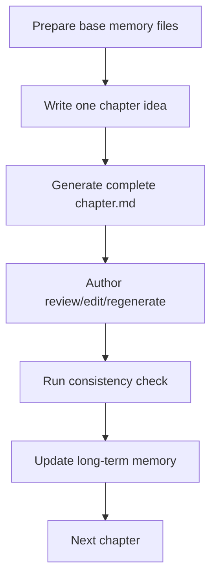

# Novel Writing Pipeline

A local-first long-form fiction pipeline powered by local LLMs, LoRA adapters, and structured story memory.

[](#)
[](#)
[](#)
[](#)
[](#)
[](https://huggingface.co/yuxinlu1/qwen3-6-27b-chinese-fiction-lora)

English | [简体中文](./README.md)

GitHub: [DuckTraDo/Novel](https://github.com/DuckTraDo/Novel) · LoRA: [Hugging Face release](https://huggingface.co/yuxinlu1/qwen3-6-27b-chinese-fiction-lora)

This project turns long-form fiction writing into a repeatable loop: the author decides the direction of each chapter, the model drafts a full chapter in one pass, and the pipeline manages long-term memory, continuity checks, and future context.

The old scene-level workflow is deprecated because multiple independent generations can easily create repetition and fragmentation. The recommended workflow now generates one complete chapter at a time.

## Workflow



## ✨ Features

- Local-first workflow with no dependency on cloud-hosted models
- OpenAI-compatible API support
- Ready for llama.cpp server or another compatible service
- LoRA-ready writing style adaptation
- One chapter idea generates one complete chapter
- Structured story memory for characters, events, timeline, foreshadowing, and summaries
- Post-chapter memory updates
- Full-chapter consistency checking
- File-based pipeline: simple, inspectable, and database-free

## 🖋️ LoRA Weights

The first Chinese fiction prose LoRA is available on Hugging Face:

**https://huggingface.co/yuxinlu1/qwen3-6-27b-chinese-fiction-lora**

LoRA weights are not stored in this GitHub repo. This repo contains only pipeline code, docs, and configuration templates.

## 📁 Project Structure

```text
pipeline/
├── config.yaml
├── README.md
├── README_EN.md
├── SECURITY_CHECKLIST.md
│
├── memory/
│   ├── story_bible.yaml
│   ├── characters.yaml
│   ├── foreshadowing.yaml
│   ├── relationships.json
│   ├── timeline.jsonl
│   ├── events.jsonl
│   ├── chapter_summaries.jsonl
│   └── style_bank.jsonl
│
├── outlines/
│   └── book_outline.yaml
│
├── chapters/
│   └── ch001/
│       └── chapter.md
│
├── outputs/
│   └── reports/
│
└── scripts/
    ├── utils.py
    ├── generate_chapter_local.py
    ├── check_consistency.py
    ├── update_memory_after_chapter.py
    └── reset_chapter.py
```

## 🚀 Recommended Writing Workflow

### 1. Before starting a new book, edit the base files

- `memory/story_bible.yaml`
- `memory/characters.yaml`
- `outlines/book_outline.yaml`
- `memory/style_bank.jsonl`
- `memory/foreshadowing.yaml` optional

### 2. For each chapter, write one chapter idea

```powershell
python scripts/generate_chapter_local.py --chapter ch001 --idea "Chapter 1: The protagonist returns to their hometown, finds a letter left by their father, and decides to investigate an old family secret." --target-words 4000 --overwrite
```

You can also read the idea from a file:

```powershell
python scripts/generate_chapter_local.py --chapter ch001 --idea-file inputs/ch001_idea.txt --target-words 4000 --overwrite
```

### 3. Author review/edit

The draft is saved at:

```text
chapters/ch001/chapter.md
```

If the draft is not good enough, edit it manually or regenerate it.

### 4. Consistency check

```powershell
python scripts/check_consistency.py --chapter ch001
```

### 5. Update long-term memory

```powershell
python scripts/update_memory_after_chapter.py --chapter ch001
```

### 6. Repeat for the next chapter

```powershell
python scripts/generate_chapter_local.py --chapter ch002 --idea "Chapter 2: The next chapter idea goes here." --target-words 4000 --overwrite
```

## 🧩 Core Files

- `memory/story_bible.yaml`: story bible for worldbuilding, themes, constraints, and writing rules
- `memory/characters.yaml`: character profiles and current character state
- `memory/foreshadowing.yaml`: foreshadowing setup, status, and payoff tracking
- `memory/events.jsonl`: important events as appendable records
- `memory/timeline.jsonl`: timeline entries for continuity checks
- `memory/chapter_summaries.jsonl`: compact chapter summaries for later context
- `memory/style_bank.jsonl`: prose references and style preferences
- `outlines/book_outline.yaml`: book-level direction and structure
- `chapters/<chapter_id>/chapter.md`: chapter draft
- `outputs/reports/`: generation, consistency, and memory update reports

## Script Reference

### Generate a chapter

```powershell
python scripts/generate_chapter_local.py --chapter ch001 --idea "Chapter 1: The protagonist returns to their hometown, finds a letter left by their father, and decides to investigate an old family secret." --target-words 4000 --overwrite
```

Common options:

- `--idea` / `--idea-file`: choose exactly one
- `--target-words`: target Chinese character count, default 4000
- `--overwrite`: allow replacing an existing `chapter.md`
- `--no-context`: generate only from the idea, without long-term memory
- `--dry-run`: build the prompt and report without calling the LLM

### Check consistency

```powershell
python scripts/check_consistency.py --chapter ch001
```

### Update memory

```powershell
python scripts/update_memory_after_chapter.py --chapter ch001
```

### Reset a chapter

```powershell
python scripts/reset_chapter.py --chapter ch001
```

By default this deletes only:

- `chapters/ch001/`
- `outputs/reports/ch001_*`

To also filter that chapter out of long-term memory:

```powershell
python scripts/reset_chapter.py --chapter ch001 --include-memory
```

Only these files are filtered:

- `memory/chapter_summaries.jsonl`
- `memory/events.jsonl`
- `memory/timeline.jsonl`

It does not delete the story bible, character files, book outline, style bank, or foreshadowing file.

## 🛡️ Privacy / Safety

This repository is designed for local writing and local inference. Before publishing or pushing changes, make sure private artifacts stay private:

- Do not commit `.env`
- Do not commit credentials, tokens, or local access secrets
- Do not commit local model or adapter files
- Do not commit private drafts in `chapters/`
- Do not commit generated artifacts in `outputs/`
- Do not commit raw training text or unauthorized source material
- The current `.gitignore` excludes common local models, private drafts, and generated reports by default

## 🗺️ Roadmap

- [x] File-based story memory
- [x] Full-chapter generation
- [x] Post-chapter memory update
- [x] Full-chapter consistency checker
- [x] First Chinese fiction LoRA released on Hugging Face
- [ ] Web UI
- [ ] Retrieval-enhanced memory
- [ ] Multi-LoRA style library
- [ ] One-click manuscript export

## 🤝 Contributing

Issues and PRs are welcome. Useful contribution areas include prompt improvements, pipeline scripts, consistency checking, and local model compatibility.

## License

License: TBD. A proper open-source license will be added soon.
