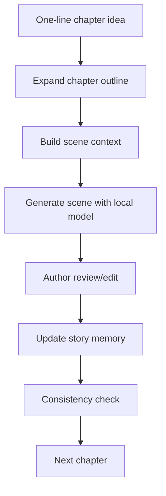

# Novel Writing Pipeline

A local-first long-form fiction pipeline powered by local LLMs, LoRA adapters, and structured story memory.

[](#)
[](#)
[](#)
[](#)
[](#)
[](#license)

English | [简体中文](./README.md)

📚 Novel Writing Pipeline is a local-first workflow for drafting long-form fiction with local models. It does not ask a model to write an entire book in one pass. Instead, it turns novel writing into a repeatable loop:

one-line chapter idea → expanded chapter outline → scene-level context → local model scene draft → author review → memory update → consistency check → next chapter

> The author stays in control.  
> The model drafts scenes.  
> The pipeline remembers the story.

## Table of Contents

- [What It Is](#what-it-is)
- [Workflow](#workflow)
- [✨ Features](#features)
- [🧠 Why Structured Memory Matters](#why-structured-memory-matters)
- [📁 Project Structure](#project-structure)
- [🚀 Quick Start](#quick-start)
- [🧩 Core Files](#core-files)
- [🖋️ LoRA Roadmap](#lora-roadmap)
- [🛡️ Privacy / Safety](#privacy-safety)
- [🗺️ Roadmap](#roadmap)
- [🤝 Contributing](#contributing)
- [📌 License](#license)

## What It Is

This project is a file-based fiction pipeline for writers and builders experimenting with local LLMs. It combines chapter outlining, scene-level context building, local text generation, structured memory updates, and consistency checks into one practical workflow.

It is intentionally simple: no database is required, and the core state lives in readable YAML / JSONL files.

## Workflow



<a id="features"></a>

## ✨ Features

- Local-first workflow with no dependency on cloud-hosted models
- OpenAI-compatible API support
- Ready for llama.cpp server
- LoRA-ready writing style adaptation
- One-line chapter idea expansion
- Scene-level context builder
- Structured story memory
- Post-chapter memory updates
- Consistency checking
- File-based pipeline: simple, inspectable, and database-free

<a id="why-structured-memory-matters"></a>

## 🧠 Why Structured Memory Matters

Long novels cannot rely on one giant context window. A book with hundreds of thousands of words, or even a million words, cannot be fed back into the model every time. More importantly, continuity is not just about text length. Characters change, promises are made, foreshadowing needs payoff, and timelines drift unless they are tracked.

This pipeline keeps the story in structured memory:

- story bible: world, themes, rules, and constraints
- character memory: character profiles, relationships, and changes
- events: important things that have already happened
- timeline: order, time jumps, and sequence
- foreshadowing: setup, status, and payoff
- summaries: chapter-level compression
- style bank: reusable prose references and preferences

Each scene receives the context it needs, while the author keeps final control over direction and revision.

<a id="project-structure"></a>

## 📁 Project Structure

```text
pipeline/
├── config.yaml                 # Global configuration
├── README.md                   # Chinese README
├── README_EN.md                # English README
├── SECURITY_CHECKLIST.md       # Safety checklist
│
├── memory/                     # Persistent story memory
│   ├── story_bible.yaml        # World, themes, and writing rules
│   ├── characters.yaml         # Character profiles
│   ├── foreshadowing.yaml      # Foreshadowing tracker
│   ├── relationships.json      # Character relationships
│   ├── timeline.jsonl          # Timeline records
│   ├── events.jsonl            # Event records
│   ├── chapter_summaries.jsonl # Chapter summaries
│   └── style_bank.jsonl        # Prose style references
│
├── outlines/                   # Outline files
│   ├── book_outline.yaml       # Book-level outline
│   └── chapter_outlines.yaml   # Chapter and scene outlines
│
├── chapters/                   # Local private drafts, ignored by default
├── outputs/                    # Local generated contexts and reports, ignored by default
│
└── scripts/                    # Pipeline scripts
    ├── utils.py
    ├── expand_chapter_outline.py
    ├── build_context.py
    ├── generate_scene_local.py
    ├── update_memory_after_chapter.py
    └── check_consistency.py
```

<a id="quick-start"></a>

## 🚀 Quick Start

### 1. Install dependencies

```powershell
pip install openai pyyaml
```

### 2. Point the pipeline at your local model server

The example below uses an OpenAI-compatible local endpoint. Replace the model value with the name exposed by your own server.

```powershell
$env:LLM_BASE_URL="http://localhost:18084/v1"
$env:LLM_API_KEY="local"
$env:LLM_MODEL="your-model-name.gguf"
```

### 3. Expand a chapter outline

```powershell
python scripts/expand_chapter_outline.py --chapter ch001 --idea "第一章：王二在肉铺下班，买半斤肉去桥下看父亲。父子关系冷淡，父亲咳血但藏起来。" --overwrite
```

### 4. Generate scene drafts

```powershell
python scripts/generate_scene_local.py --chapter ch001 --scene scene001
python scripts/generate_scene_local.py --chapter ch001 --scene scene002
python scripts/generate_scene_local.py --chapter ch001 --scene scene003
```

### 5. Check continuity and update memory

```powershell
python scripts/check_consistency.py --chapter ch001
python scripts/update_memory_after_chapter.py --chapter ch001
```

<a id="core-files"></a>

## 🧩 Core Files

- `memory/story_bible.yaml`: story bible for worldbuilding, themes, constraints, and prose rules
- `memory/characters.yaml`: character profiles and current character state
- `memory/foreshadowing.yaml`: foreshadowing setup, status, and payoff tracking
- `memory/events.jsonl`: important events as appendable records
- `memory/timeline.jsonl`: timeline entries for continuity checks
- `memory/chapter_summaries.jsonl`: compact chapter summaries for later context
- `memory/style_bank.jsonl`: prose references and style preferences
- `outlines/book_outline.yaml`: book-level direction and structure
- `outlines/chapter_outlines.yaml`: structured chapter and scene outlines

<a id="lora-roadmap"></a>

## 🖋️ LoRA Roadmap

The first prose-style LoRA release will focus on a plain, restrained, darkly humorous Chinese realist prose style. It is designed for testing grounded family drama, small-town realism, working-class characters, and emotionally restrained narration.

The first LoRA will be released for free and open use. More style adapters and demo projects are coming soon.

Future style directions may include:

- Realist fiction
- Crime and suspense
- Mythic and supernatural tales
- Emotion-driven romance
- Short-drama web fiction
- Classical court intrigue
- Dark comedy

<a id="privacy-safety"></a>

## 🛡️ Privacy / Safety

This repository is designed for local writing and local inference. Before publishing or pushing changes, make sure private artifacts stay private:

- Do not commit `.env`
- Do not commit credentials, tokens, or local access secrets
- Do not commit GGUF / safetensors / LoRA model or adapter files
- Do not commit private drafts in `chapters/`
- Do not commit generated artifacts in `outputs/`
- The current `.gitignore` excludes common local models, private drafts, generated contexts, and reports by default

<a id="roadmap"></a>

## 🗺️ Roadmap

- [x] File-based memory system
- [x] Automatic chapter outline expansion
- [x] Scene-level context building
- [x] Local model scene generation
- [x] Post-chapter memory updates
- [x] Consistency checking
- [ ] Example novel demo
- [ ] Web UI
- [ ] BM25 / FAISS retrieval
- [ ] GraphRAG
- [ ] Multi-LoRA style library
- [ ] One-click manuscript export

<a id="contributing"></a>

## 🤝 Contributing

Issues and PRs are welcome. Useful contribution areas include:

- prompt improvements
- Chinese prose style examples
- pipeline scripts
- consistency checker improvements
- local model compatibility

<a id="license"></a>

## 📌 License

License: TBD. A proper open-source license will be added soon.
