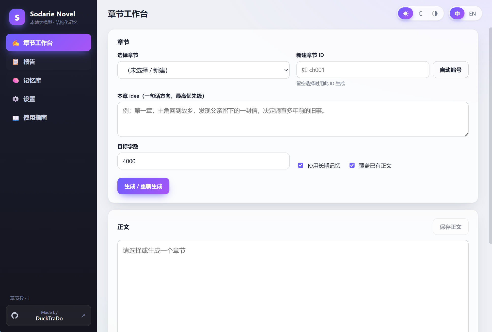
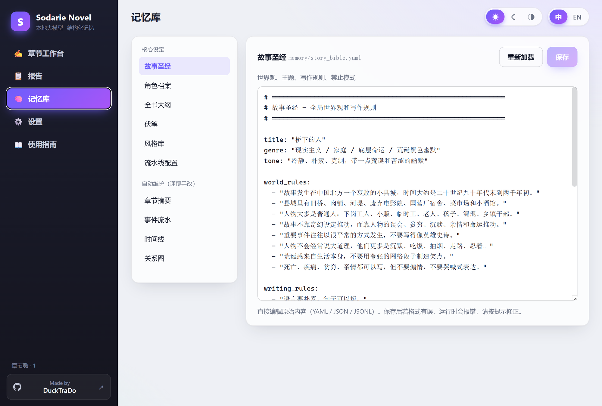
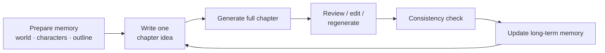

<div align="center">


# Sodarie Novel

**Local LLM · Structured Memory · Long-form Fiction Writing Studio**

A "you steer, the model rows" machine for long novels: you set the direction in one
sentence, the model drafts a whole chapter at once, and the pipeline handles long-term
memory, continuity checks and context — so the book gets *more* consistent as it grows.

[](#-sodarie-novel-desktop-app)
[](#)
[](#)
[](#)
[](#)
[](https://huggingface.co/yuxinlu1/qwen3-6-27b-chinese-fiction-lora)
[](./LICENSE)

[English](./README_EN.md) · [简体中文](./README.md) · [GitHub](https://github.com/DuckTraDo/Novel) · [LoRA weights](https://huggingface.co/yuxinlu1/qwen3-6-27b-chinese-fiction-lora)

</div>

---

## ✨ Why use it

- 🖥️ **Desktop app, ready to use** — install, set one model URL, and write. **No Python, no repo clone.**
- 🧠 **Structured long-term memory** — characters, foreshadowing, timeline, events and chapter summaries are maintained automatically; cures the "drift" of long books.
- ✍️ **One-line idea → full chapter** — give a sentence, get a complete chapter; the idea always has top priority.
- 🔍 **Continuity check** — a built-in "editor" catches info revealed too early, setting drift, missed foreshadowing, AI-ish phrasing.
- 🎨 **Pretty and pleasant** — Chinese / English, light / dark / warm themes, a 2026-style UI.
- 📂 **File-based, simple & stable** — plain YAML / JSON / Markdown, no database; readable, backup-able, hand-editable.
- 🔌 **Bring your own local inference** — OpenAI-compatible endpoint (llama.cpp / vLLM…); optional LoRA style.

> 📣 Actively maintained — open an [Issue](https://github.com/DuckTraDo/Novel/issues) with feedback and I'll **fix / update promptly**.

---

## 🖼️ Screenshots

<div align="center">

<table>
<tr>
<td align="center"><b>Chapter Workbench</b></td>
<td align="center"><b>Memory</b></td>
</tr>
<tr>
<td></td>
<td></td>
</tr>
</table>

</div>

---

## 🖥️ Sodarie Novel desktop app

`app/` is a **Tauri (Rust + React)** desktop app. The engine is **rewritten natively in Rust**,
so end users only need two things:

1. The installer `Sodarie Novel_<version>_x64-setup.exe` (or `.dmg` / `.AppImage`)
2. An OpenAI-compatible model endpoint (your own local inference server, e.g. llama.cpp / vLLM)

On first launch it auto-creates a project in your user data directory and seeds the templates.

### 🚀 Ready to use (end users)

Download the installer for your platform from [**Releases**](https://github.com/DuckTraDo/Novel/releases): Windows `*-setup.exe` · macOS `*.dmg` (arm64 / x64) · Linux `*.AppImage` / `*.deb`.

1. Install and open **Sodarie Novel**.
2. Go to **Settings**, set the **LLM Base URL** (must include `http://`; most local servers live under `/v1`, e.g. `http://127.0.0.1:18180/v1`) and the model name.
3. Back to **Workbench**, create `ch001` → write a one-line idea → **Generate**. Start writing! ✨

> New here? The in-app **📖 Guide** (left tab) has a detailed bilingual tutorial.

### 🧭 What the app does

| Tab | Purpose |
| --- | --- |
| ✍️ Workbench | Select / new chapter → idea + target length → generate / regenerate → edit & save text → consistency check / update memory / reset |
| 📋 Reports | In-app rendering of generation / consistency / memory-update reports |
| 🧠 Memory | Edit story bible, characters, outline, foreshadowing, style bank — without hand-writing raw YAML |
| ⚙️ Settings | Project directory, LLM URL / key / model; language & theme switch |
| 📖 Guide | Built-in bilingual tutorial |

### 🛠️ Develop / build from source

Requirements: Node.js 18+ and npm, Rust toolchain (`rustc` / `cargo`).

```powershell
cd app
npm install
npm run tauri dev      # development
npm run tauri build    # build installer (NSIS)
```

---

## 🔁 Writing loop



> Mantra: **the idea decides what this chapter is about; the memory decides whether it lines up with everything before.**

---

## 🧩 What's in the memory

| File | Purpose |
| --- | --- |
| `memory/story_bible.yaml` | Story bible: world rules, themes, writing rules, forbidden patterns |
| `memory/characters.yaml` | Character files: status, knows, secrets, relationships, constraints |
| `outlines/book_outline.yaml` | Overall direction, structure and chapter plan |
| `memory/foreshadowing.yaml` | Foreshadowing tracker: active / resolved states |
| `memory/style_bank.jsonl` | Style samples (one `{id, text}` per line); the model mimics this voice |
| `memory/events.jsonl` · `timeline.jsonl` · `chapter_summaries.jsonl` | Auto-maintained event / timeline / summary ledgers |
| `memory/relationships.json` | Character relationship graph (nodes + edges) |
| `chapters/<id>/chapter.md` · `outputs/reports/` | Chapter text · reports |

> `events / timeline / summaries / relationships` are written automatically by "Update memory" — usually no need to edit by hand.

---

## 🖋️ LoRA style weights

The first Chinese-fiction style LoRA is published on Hugging Face:

**<https://huggingface.co/yuxinlu1/qwen3-6-27b-chinese-fiction-lora>**

> LoRA weights are not stored in the repo; the repo only holds code, docs and config templates.

---

## ⌨️ Command-line version (advanced / terminal users)

Besides the desktop app, `scripts/*.py` provides the equivalent CLI flow (needs Python 3.10+ with `openai` and `pyyaml`).

<details>
<summary>Show CLI usage</summary>

```powershell
# 1. Generate a chapter
python scripts/generate_chapter_local.py --chapter ch001 --idea "Ch.1: the hero returns home, finds a letter from his father, and decides to investigate an old case." --target-words 4000 --overwrite

# 2. Consistency check
python scripts/check_consistency.py --chapter ch001

# 3. Update long-term memory
python scripts/update_memory_after_chapter.py --chapter ch001

# 4. Reset a chapter (text/reports only; add --include-memory to also filter summaries/events/timeline)
python scripts/reset_chapter.py --chapter ch001
```

`generate_chapter_local.py` common flags:

- `--idea` / `--idea-file`: pick one
- `--target-words`: target length, default 4000
- `--overwrite`: allow overwriting an existing `chapter.md`
- `--no-context`: ignore long-term memory, generate from the idea only
- `--dry-run`: only build the prompt and report, don't call the LLM

</details>

---

## 🛡️ Safety & privacy

Built for local writing and local inference. When making the repo public (most is already covered by `.gitignore`):

- ❌ Don't commit `.env`, API keys, access tokens or other credentials
- ❌ Don't commit local model / LoRA adapter files
- ❌ Don't commit private manuscripts `chapters/`, generated `outputs/`, or local settings `.ui-settings.json`
- ❌ Don't commit raw training data or unlicensed text

See [`SECURITY_CHECKLIST.md`](./SECURITY_CHECKLIST.md).

---

## 🗺️ Roadmap

- [x] File-based memory system
- [x] Whole-chapter generation
- [x] Post-chapter memory update
- [x] Full-chapter consistency check
- [x] First Chinese-fiction LoRA on Hugging Face
- [x] Desktop app (Tauri, Rust engine, bilingual + themes)
- [ ] Retrieval-augmented memory (RAG)
- [ ] Multi-LoRA style library
- [ ] One-click manuscript export

---

## 🤝 Feedback · Contributing · License

> 📣 **Actively maintained.** Found a bug or have an idea? Open an [Issue](https://github.com/DuckTraDo/Novel/issues) — I'll fix and update promptly.

PRs welcome too, especially for prompt improvements, pipeline scripts, consistency checking, and local-model compatibility.

License: [MIT](./LICENSE) © 2026 DuckTraDo.

<div align="center">

Made by [**DuckTraDo**](https://github.com/DuckTraDo)

</div>
